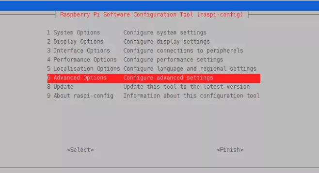
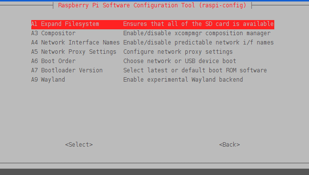

# 树莓派eMMC扩容分区

## 1. Raspbian系统（树莓派官方系统）

1. 使用命令

   ```
   raspi-config
   ```

2. 选择 Advanced Options
   

3. 选择 Expand Filesystem
   

4. 重启即可扩容成功。


## 2. 非树莓派官方系统

1. 查看硬盘列表及分区信息

   ```
   [root@localhost install]# lsblk
   NAME         MAJ:MIN RM  SIZE RO TYPE MOUNTPOINT
   mmcblk0      179:0    0 29.1G  0 disk
   ├─mmcblk0p3  179:3    0 2.1G  0 part /
   ├─mmcblk0p1  179:1    0  286M  0 part /boot
   └─mmcblk0p2  179:2    0  488M  0 part [SWAP]
   mmcblk0boot0 179:32   0    4M  1 disk
   mmcblk0boot1 179:64   0    4M  1 disk
   
   [root@localhost install]# df -Th
   Filesystem     Type      Size  Used Avail Use% Mounted on
   /dev/root      ext4       28G  4.8G   24G  18% /
   devtmpfs       devtmpfs  3.8G     0  3.8G   0% /dev
   tmpfs          tmpfs     3.9G     0  3.9G   0% /dev/shm
   tmpfs          tmpfs     3.9G   17M  3.9G   1% /run
   tmpfs          tmpfs     3.9G     0  3.9G   0% /sys/fs/cgroup
   /dev/mmcblk0p1 vfat      286M   54M  233M  19% /boot
   tmpfs          tmpfs     782M     0  782M   0% /run/user/0
   ```

2. 使用命令

   ```shell
   #1.使用parted分区工具
   parted
    
   #2.按p打印分区情况
   p
    
   #3.扩容分区 3是p命令获得的分区number 100%的意思是100%的空闲空间
   resizepart 3 100%
   
   # w或quit保存退出
   quit
   ```

3. resizepart成功后resize分区,并重启系统

   ```shell
   #ext使用resize2fs xfs使用xfs_grows
   resize2fs /dev/mmblk0p3
   ```

4. lsblk查看分区情况已经扩容成功

   ```shell
   [root@localhost install]# lsblk
   NAME         MAJ:MIN RM  SIZE RO TYPE MOUNTPOINT
   mmcblk0      179:0    0 29.1G  0 disk
   ├─mmcblk0p3  179:3    0 28.4G  0 part /
   ├─mmcblk0p1  179:1    0  286M  0 part /boot
   └─mmcblk0p2  179:2    0  488M  0 part [SWAP]
   mmcblk0boot0 179:32   0    4M  1 disk
   mmcblk0boot1 179:64   0    4M  1 disk
   ```

   