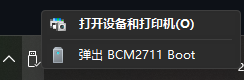

# 树莓派板载eMMC烧录系统

## 系统及硬件信息

1. 操作系统：Windows 11
2. 树莓派计算模块型号：Raspberry Pi Compute Model 4

## 操作流程

### 1. 硬件处理

### 2. 安装驱动

下载地址：https://github.com/raspberrypi/usbboot/raw/master/win32/rpiboot_setup.exe

安装完成后文件夹内容：

### 3. 烧录系统

1. 给树莓派插电开机。

2. 使用数据线连接树莓派和电脑，可读取到eMMC。
   

3. 打开第二步安装驱动的文件夹，运行`rpiboot.exe`文件，读取并加载eMMC，识别为可移动存储设备。
   

4. 烧录系统

   树莓派官方烧录工具下载（可烧录自定义镜像）：https://github.com/raspberrypi/rpi-imager/releases。

   RPI-MSD-0001 就是通过驱动加载出的eMMC板载存储。
   

