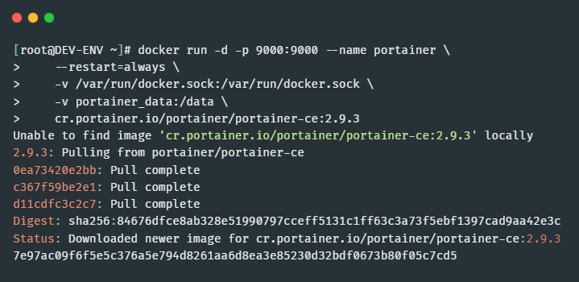
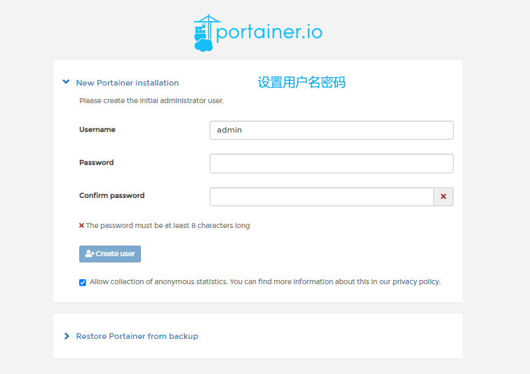
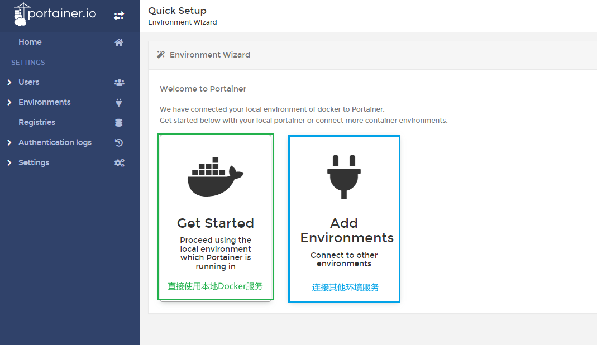
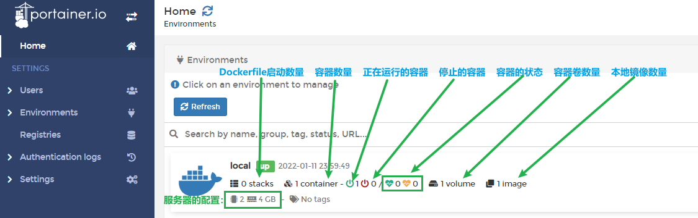
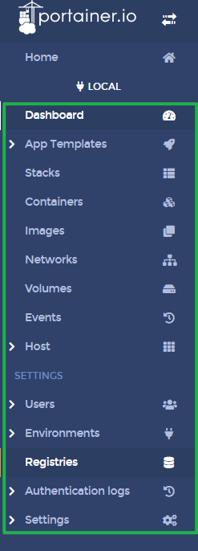

# Portainer

> 官网地址：[https://www.portainer.io/](https://www.portainer.io/)
>
> Github地址：https://github.com/portainer/portainer
>
> Docker可视化管理面板

## 安装命令

> 官网安装文档：[https://docs.portainer.io/v/ce-2.9/start/install/server/docker/linux](https://docs.portainer.io/v/ce-2.9/start/install/server/docker/linux)

执行命令后会自动拉取镜像：

```bash
docker volume create portainer_data

docker run -d -p 9000:9000 --name portainer \
    --restart=always \
    -v /var/run/docker.sock:/var/run/docker.sock \
    -v portainer_data:/data \
    cr.portainer.io/portainer/portainer-ce:2.9.3
```



## 设置Portainer

> 通过ip:9000访问 Portainer

### 设置用户名密码



### 连接Docker服务





### 侧边栏介绍



- Dashboard：可以直观的看到Docker服务的基础信息，如容器，数据卷，镜像等
- App Templates：可以配置容器镜像版本及启动模板
- Stacks：可管理正在运行中的Stack，也可编写Dockerfile运行Stack
- Containers：所有的容器列表，可对所有容器进行管理（启动，停止，重启等），也可查看容器的相关信息（如cpu，内存，logs，网络信息，build layer信息）
- Networks：可以进行网络管理
- Volumes：管理Docker的数据卷
- Events：记录所有的Docker操作
- Host：可查看宿主机信息及配置Portainer权限信息和Docker仓库信息