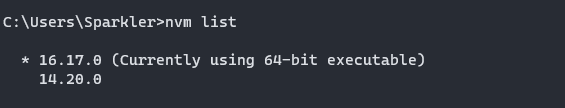
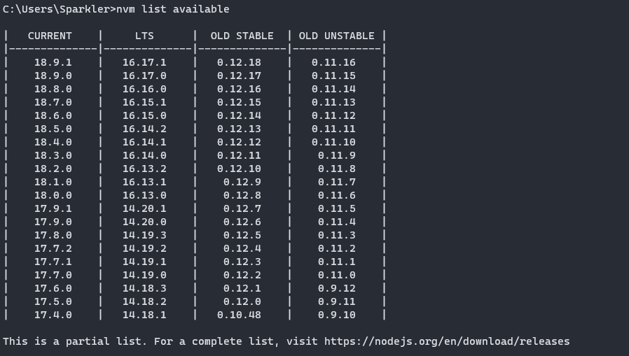
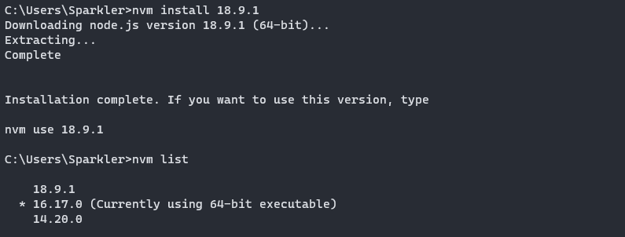
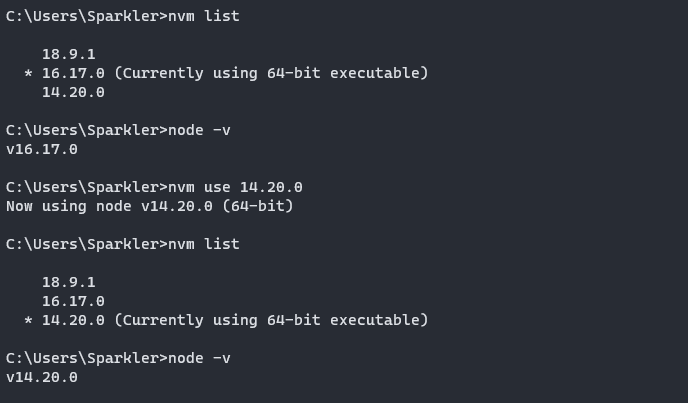

**NVM：Node版本管理工具（需要以管理员身份运行指令）**

>  nvm list 查看现在所有安装的node版本

> nvm list available 查看nodejs 官方的所有版本

> nvm install （版本号）下载对应的node版本号

> nvm use 切换node版本

Nrm

nrm ls **查看可选源 星号代表当前使用源**

nrm use 使用源