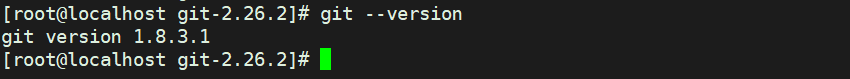

# ⽅式⼀：通过包管理器安装

[官网说明](https://git-scm.com/download/linux)

 在 Linux 上安装 Git 向来仅需⼀⾏命令即可搞定，对于CentOS 系统来讲，直接执⾏如下命令即可安装： 

```sh
yum install git
```

当然通过这种⽅式安装的 Git 可能不是较新版的 Git ，以我们的实验环境 CentOS 7.4 来说，这种⽅式安装的 Git 版本为 1.8.3.1 ，不过⼀般来说是够的。 

# ⽅法⼆：通过源码编译安装 
 ## 1、准备Git安装包
[官网下载](https://mirrors.edge.kernel.org/pub/software/scm/git/)

我这⾥选择安装的是 2.26.2 版，将下载好的安装包 v2.26.2.tar.gz 直接放在了 root ⽬录下

```bash
[root@localhost maven]# find / -name Git-v2.26.2.tar.gz
/root/Git-v2.26.2.tar.gz
```

然后将其本地解压，得到 git-2.26.2 ⽬录： 

```sh
tar -zxvf Git-v2.26.2.tar.gz
```

## 2、提前安装可能所需的依赖 

```sh
yum update
yum install -y curl-devel expat-devel gettext-devel openssl-devel zlibdevel gcc-c++ perl-ExtUtils-MakeMaker autoconf
```

## 3、编译安装Git 
 进⼊到对应⽬录，执⾏配置、编译、安装命令即可，如下所示： 

```sh
cd git-2.26.2
make configure
./configure --prefix=/usr/local/git
make profix=/usr/local/git
make install
```

## 4、将Git加⼊环境变量 
 将 Git 的可执⾏程序加⼊环境变量，便于后续使⽤
编辑配置⽂件： 

```sh
vi /etc/profile
```

尾部加⼊ Git 的 bin 路径配置即可 

```sh
# Git
export GIT_HOME=/usr/local/git
export PATH=$PATH:$GIT_HOME/bin
```

最后执⾏ `source /etc/profile` 使环境变量⽣效即可。 

## 5、查看安装结果
执⾏ `git --version` 查看安装后的版本即可 


