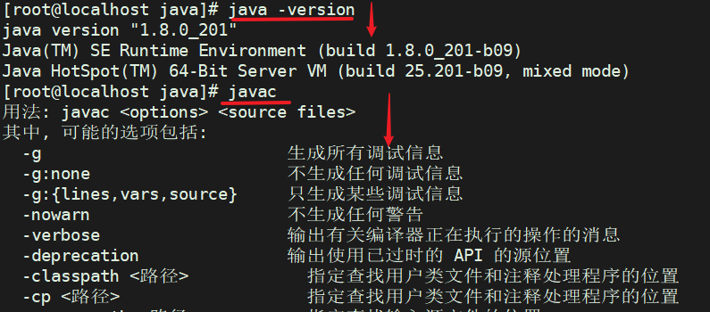

1.准备JDK安装包 
 我这⾥下载的是 `jdk-8u201-linux-x64.tar.gz` 安装包，并上传在 root ⽬录下 

2.卸载已有的OPENJDK（如果有） 
 如果系统⾃带有 OpenJDK ，可以按照如下步骤提前卸载之。
⾸先查找已经安装的 OpenJDK 包：  

```plain
rpm -qa | grep java
```


接下来可以将 java 开头的安装包均卸载即可： 

```plain
yum -y remove java-1.7.0-openjdk-1.7.0.141-2.6.10.5.el7.x86_64
yum -y remove java-1.8.0-openjdk-1.8.0.131-11.b12.el7.x86_64
... 省略 ...
```


创建⽬录并解压 
 1、在 /usr/local/ 下创建 java ⽂件夹并进⼊  

```plain
cd /usr/local/
mkdir java
cd java
```

2、将上⾯准备好的 JDK 安装包解压到 /usr/local/java 中即可 

```plain
tar -zxvf /h/jdk-8u201-linux-x64.tar.gz -C ./
```

解压完之后， /usr/local/java ⽬录中会出现⼀个 `jdk1.8.0_201` 的⽬录 

配置JDK环境变量 
编辑 /etc/profile ⽂件，在⽂件尾部加⼊如下 JDK 环境配置即可 :`vi /etc/profile`

```plain
# JAVA
JAVA_HOME=/usr/local/java/jdk1.8.0_201
CLASSPATH=$JAVA_HOME/lib/
PATH=$PATH:$JAVA_HOME/bin
export PATH JAVA_HOME CLASSPATH
```

然后执⾏如下命令让环境变量⽣效 

```plain
source /etc/profile
```

验证JDK安装结果 
 输⼊如下命令即可检查安装结果：  

```plain
java -version
javac
```

