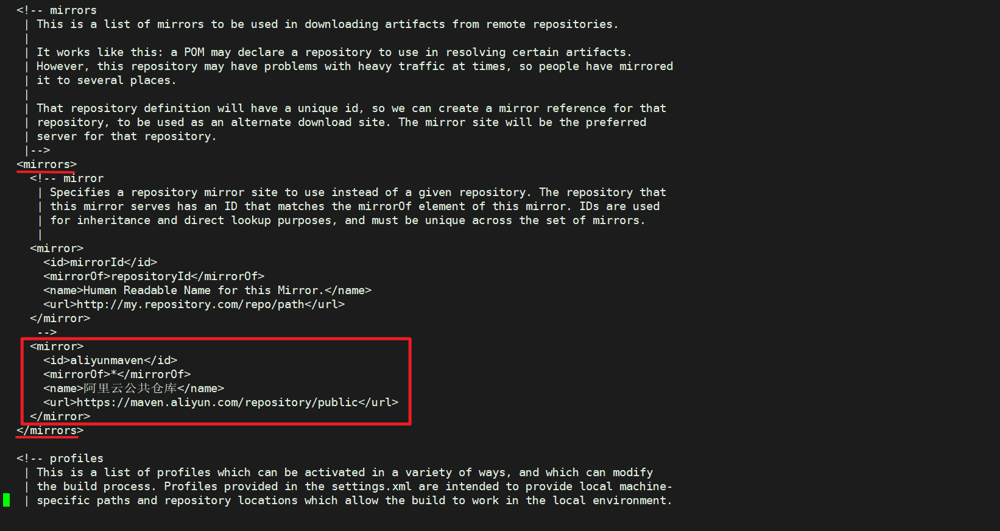
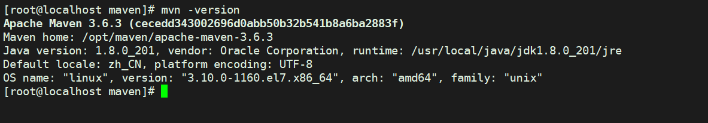

# 准备Maven安装包

[官网下载](https://maven.apache.org/download.cgi) 这⾥下载的是 `apache-maven-3.6.3-bin.tar.gz` 安装包

# 解压Maven源码安装包

创建目录

```
mkdir -p /opt/maven
```

解压源码包： 

```plain
cd /opt/maven
tar zxvf /root/apache-maven-3.6.3-bin.tar.gz  -C ./
```

即可在当前⽬录得到 /opt/maven/apache-maven-3.6.3 ⽬录 

# 配置Maven加速镜像源
这⾥配置的是[阿⾥云的maven镜像源](https://developer.aliyun.com/mvn/guide?spm=a2c6h.13651104.0.0.3c8536a4uYQ82x)。
编辑修改 /opt/maven/apache-maven-3.6.3/conf/settings.xml⽂件，在 <mirrors></mirrors> 标签对⾥添加如下内容即可： 

```plain
<mirror>
  <id>aliyunmaven</id>
  <mirrorOf>*</mirrorOf>
  <name>阿里云公共仓库</name>
  <url>https://maven.aliyun.com/repository/public</url>
</mirror>
```



# 配置环境变量
编辑修改 /etc/profile ⽂件，在⽂件尾部添加如下内容，配置 maven 的安装路径 

`vi /etc/profile`

```plain
# Maven
export MAVEN_HOME=/opt/maven/apache-maven-3.6.3
export PATH=$MAVEN_HOME/bin:$PATH
```

执⾏ `source /etc/profile`来刷新环境变量，让 maven 环境的路径配置⽣效。

# 检验安装结果

执⾏ mvn –version ，能打印出 maven 版本信息说明安装、配置成功： 
