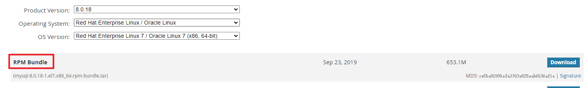

# CentOS7基于RPM包安装MySQL

## 下载安装包

官网下载地址：https://downloads.mysql.com/archives/community/

下载文件条件：



## 上传文件，解压，安装

### 解压后文件列表：

> **必要安装**
> mysql-community-common-xxx.rpm -- 通用组件
> mysql-community-libs-xxx.rpm -- 依赖
> mysql-community-client-xxx.rpm -- 客户端
> mysql-community-server-xxx.rpm -- 服务端
>
> **可选安装**
> mysql-community-devel-8.0.18-1.el7.x86_64.rpm
> mysql-community-embedded-compat-8.0.18-1.el7.x86_64.rpm
> mysql-community-libs-compat-8.0.18-1.el7.x86_64.rpm
> mysql-community-test-8.0.18-1.el7.x86_64.rpm

### 安装：

1. 安装通用组件 mysql-community-common-xxx.rpm

   ```shell
   rpm -ivh --nodeps --force mysql-community-common-xxx.rpm
   ```

2. 安装依赖 mysql-community-libs-xxx.rpm

   ```shell
   rpm -ivh --nodeps mysql-community-libs-xxx.rpm
   ```

3. 安装客户端 mysql-community-client-xxx.rpm

   ```shell
   rpm -ivh --nodeps mysql-community-client-xxx.rpm
   ```

4. 安装服务 mysql-community-server-xxx.rpm

   ```shell
   rpm -ivh --nodeps --force mysql-community-server-xxx.rpm
   ```

```shell
[root@localhost mysql]# rpm -ivh --nodeps --force mysql-community-common-8.0.18-1.el7.x86_64.rpm
warning: mysql-community-common-8.0.18-1.el7.x86_64.rpm: Header V3 DSA/SHA1 Signature, key ID 5072e1f5: NOKEY
Preparing...                          ################################# [100%]
Updating / installing...
   1:mysql-community-common-8.0.18-1.e################################# [100%]
[root@localhost mysql]# rpm -ivh --nodeps mysql-community-libs-8.0.18-1.el7.x86_64.rpm
warning: mysql-community-libs-8.0.18-1.el7.x86_64.rpm: Header V3 DSA/SHA1 Signature, key ID 5072e1f5: NOKEY
Preparing...                          ################################# [100%]
Updating / installing...
   1:mysql-community-libs-8.0.18-1.el7################################# [100%]
[root@localhost mysql]# rpm -ivh --nodeps mysql-community-client-8.0.18-1.el7.x86_64.rpm
warning: mysql-community-client-8.0.18-1.el7.x86_64.rpm: Header V3 DSA/SHA1 Signature, key ID 5072e1f5: NOKEY
Preparing...                          ################################# [100%]
Updating / installing...
   1:mysql-community-client-8.0.18-1.e################################# [100%]
[root@localhost mysql]# rpm -ivh --nodeps --force mysql-community-server-8.0.18-1.el7.x86_64.rpm
warning: mysql-community-server-8.0.18-1.el7.x86_64.rpm: Header V3 DSA/SHA1 Signature, key ID 5072e1f5: NOKEY
Preparing...                          ################################# [100%]
Updating / installing...
   1:mysql-community-server-8.0.18-1.e################################# [100%]
```

### 修改配置文件：

> MySQL 配置文件路径：/etc/my.cnf


### 配置MySQL

1. MySQL 命令

   1. 启动MySQL

      ```shell
      systemctl start mysqld
      ```

   2. 查看MySQL状态

      ```shell
      systemctl status mysqld
      ```

   3. 停止MySQL

      ```shell
      systemctl stop mysqld
      ```

2. 获取MySQL 密码

   ```shell
   # /var/log/mysqld.log 是配置文件中配置的Log文件
   grep 'temporary password' /var/log/mysqld.log
   ```

3. 登录并修改MySQL root用户密码，设置root账户远程访问

   > MySQL8默认密码要求：大写字母+小写字母+数字+特殊符号

   ```shell
   [root@localhost mysql]# mysql -u root -p
   Enter password:
   Welcome to the MySQL monitor.  Commands end with ; or \g.
   Your MySQL connection id is 9
   Server version: 8.0.18
   
   Copyright (c) 2000, 2019, Oracle and/or its affiliates. All rights reserved.
   
   Oracle is a registered trademark of Oracle Corporation and/or its
   affiliates. Other names may be trademarks of their respective
   owners.
   
   Type 'help;' or '\h' for help. Type '\c' to clear the current input statement.
   
   mysql>  alter user user() identified by "123Qwe!@#";
   Query OK, 0 rows affected (0.00 sec)
   mysql> flush privileges;
   Query OK, 0 rows affected (0.01 sec)
   mysql> use mysql;
   Database changed
   mysql> update user set user.Host='%' where user.User='root';
   Query OK, 1 row affected (0.01 sec)
   Rows matched: 1  Changed: 1  Warnings: 0
   mysql> flush privileges;
   Query OK, 0 rows affected (0.01 sec)
   ```
   
   

## 测试

使用Navicat或其他数据库工具远程连接访问数据库
