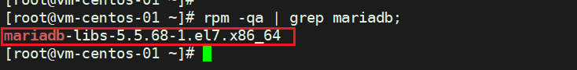

# 安装准备

>   1.   安装包下载：当前安装使用的为`mysql-8.0.18-el7-x86_64.tar.gz` [官网]()
>   2.   准备配置文件

## 卸载系统⾃带的MARIADB（如果有）

如果系统之前⾃带`Mariadb`需要卸载。查询已安装的`Mariadb`安装包：

```shell
rpm -qa | grep mariadb;

[root@vm-centos-01 ~]# rpm -qa | grep mariadb;
mariadb-libs-5.5.68-1.el7.x86_64
```



卸载:

```bash
# yum -y remove xxx
yum -y remove mariadb-libs-5.5.68-1.el7.x86_64
```

## 解压MYSQL安装包

将准备好的`MySQL`安装包解压至`/usr/local`目录，并重命名为mysql

```bash
tar -zxvf /root/mysql-8.0.18-el7-x86_64.tar.gz -C /usr/local/
cd /usr/local
mv mysql-8.0.18-el7-x86_64 mysql
```

## 创建MYSQL⽤户和⽤户组

```bash
groupadd mysql
useradd -g mysql mysql
```

## 创建MySQL数据文件夹

```
mkdir /usr/local/mysql/data
```

## 修改MYSQL⽬录的归属⽤户

```bash
cd /usr/local/mysql
chown -R mysql:mysql ./
```

## 准备MYSQL的配置⽂件

在`/etc`目录下新建`my.cnf`文件

```bash
touch /etc/my.cnf
vi /etc/my.cnf # 按 `i` 切换写入模式，按`ESC` 然后 !wq 保存退出
```

写入如下配置：

```properties
[client]
#password	= your_password
port		= 3306
socket		= /tmp/mysql.sock

[mysqld]
binlog_cache_size = 64K
thread_stack = 256K
join_buffer_size = 1024K
max_heap_table_size = 64M
# MySQL启动端口号
port		= 3306
socket		= /tmp/mysql.sock
# MySQL安装目录
basedir = /usr/local/mysql
# mysql数据文件存放位置
datadir = /usr/local/mysql/data
# MySQL启用的存储引擎
default_storage_engine = InnoDB
# 字符集设定，如果前台有连social mobile application一类包括wechat，并且允许有使用emoji表情的，请开启成utf8mb4
character_set_server = utf8mb4
```

同时使⽤如下命令创建`/var/lib/mysql`目录并修改权限：

```bash
mkdir /var/lib/mysql
chmod 777 /var/lib/mysql
```

# 开始安装MySQL

```
cd /usr/local/mysql
./bin/mysqld --initialize --user=mysql
```


## 复制启动脚本到资源⽬录

```
cp ./support-files/mysql.server /etc/init.d/mysqld
```

并修改`/etc/init.d/mysqld`,修改其中的`basedir`和`datadir`为配置的目录：

```properties
basedir=/usr/local/mysql 
datadir=/usr/local/mysql/data
```

## 设置MYSQL系统服务并开启⾃启

### ⾸先增加`mysqld`服务控制脚本执⾏权限：

```
chmod +x /etc/init.d/mysqld
```

### 同时将`mysqld`服务加⼊到系统服务：

```
chkconfig --add mysqld
```

### 最后检查`mysqld`服务是否已经⽣效：

```
chkconfig --list mysqld
```


# 启动MYSQLD

```
service mysqld start
```


## 将MySQL的BIN目录加入PATH环境变量

编辑`~/.bash_profile`文件，在文件末尾处坠下变量信息

```
# MySQL HOME
export PATH=$PATH:/usr/local/mysql/bin
```

执⾏如下命令使环境变量⽣效

```
source ~/.bash_profile
```

## 登录MySQL

`root`账户加上初始密码登录MySQL：

```
mysql -u root -p
```


## 接下来修改ROOT账户密码

```
alter user user() identified by "你的密码";
flush privileges;
```


## 设置允许远程主机登录

```
use mysql;
update user set user.Host='%' where user.User='root';
flush privileges;
```


## 开发工具测试远程连接


如果连接失败检查防火墙是否关闭或端口是否开放

```
# 关闭防火墙
systemctl stop firewalld
# 禁止开机启动防火墙
systemctl disable firewalld
```

