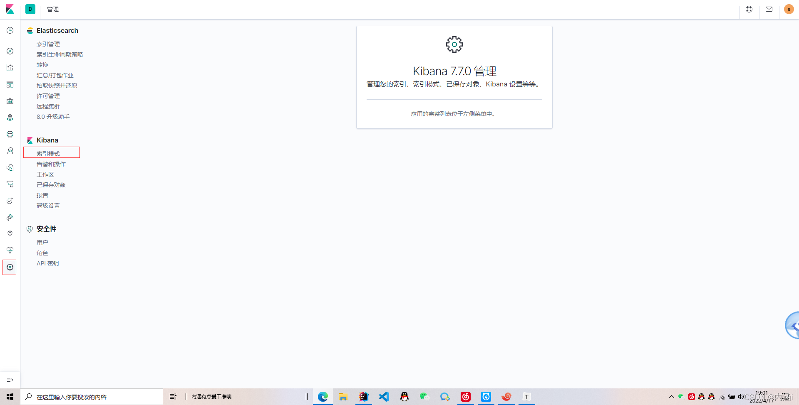
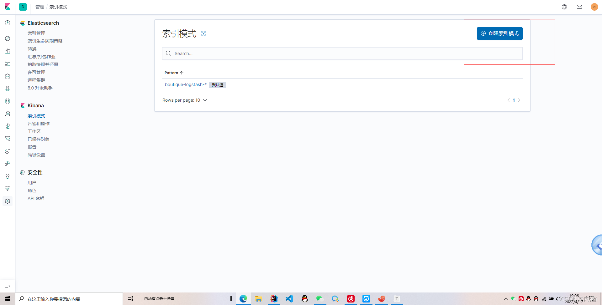
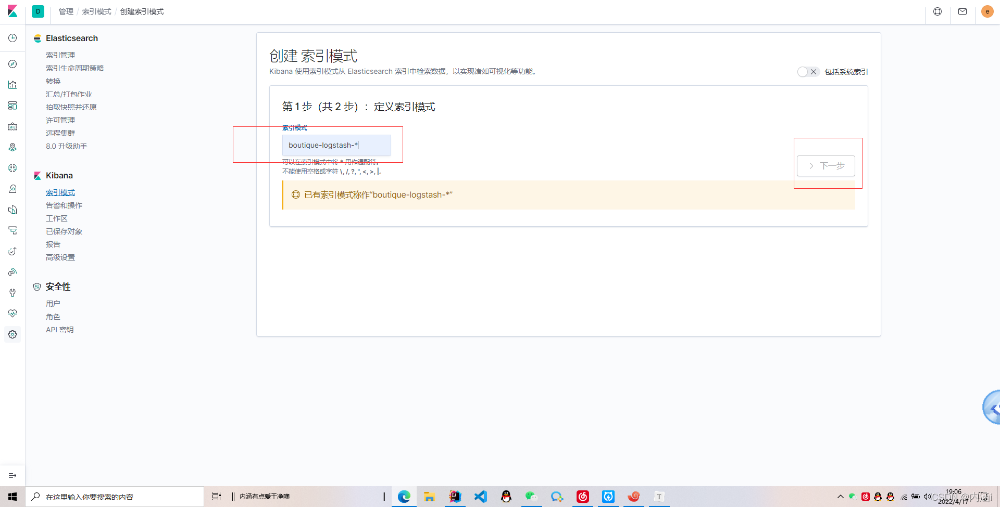
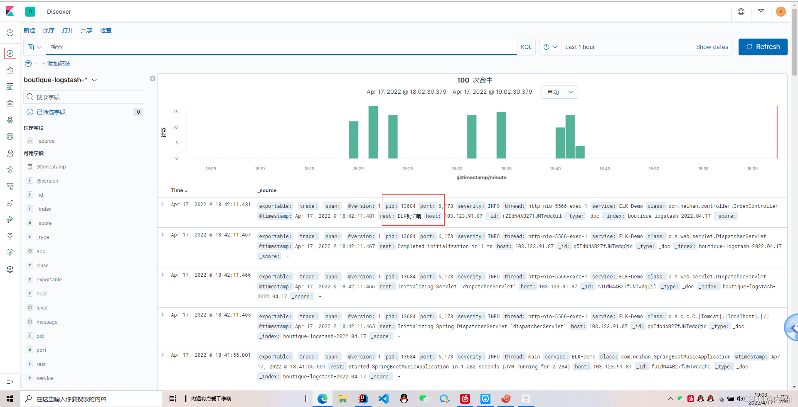

# Docker-Compose部署ELK

## 1. 配置编写

### 1.1 创建 [docker](https://so.csdn.net/so/search?q=docker&spm=1001.2101.3001.7020)-compose.yaml 文件 将以下内容写入

```yaml
version: '3'
services:
  elasticsearch:
    image: elasticsearch:7.7.0  #镜像
    container_name: elk_elasticsearch  #定义容器名称
    restart: always  #开机启动，失败也会一直重启
    environment:
      - "cluster.name=elasticsearch-spring" #设置集群名称为elasticsearch
      - "discovery.type=single-node" #以单一节点模式启动
      - "ES_JAVA_OPTS=-Xms512m -Xmx1024m" #设置使用jvm内存大小
    volumes:
      - /home/es/elasticsearch/plugins:/usr/share/elasticsearch/plugins #插件文件挂载
      - /home/es/elasticsearch/data:/usr/share/elasticsearch/data #数据文件挂载
      - /home/es/elasticsearch/config/elasticsearch.yml:/usr/share/elasticsearch/config/elasticsearch.yml #配置文件挂载
    ports:
      - 9200:9200
  kibana:
    image: kibana:7.7.0
    container_name: elk_kibana
    restart: always
    depends_on:
      - elasticsearch #kibana在elasticsearch启动之后再启动
    environment:
      - ELASTICSEARCH_URL=http://elasticsearch:9200 #设置访问elasticsearch的地址
    ports:
      - 5601:5601
  logstash:
    image: logstash:7.7.0
    container_name: elk_logstash
    restart: always
    volumes:
      - /home/es/logstash-springboot.conf:/usr/share/logstash/pipeline/logstash.conf #挂载logstash的配置文件
    depends_on:
      - elasticsearch #kibana在elasticsearch启动之后再启动
    links:
      - elasticsearch:es #可以用es这个域名访问elasticsearch服务
    ports:
      - 4560:4560
```

### 1.2 创建文件目录并授权

创建 elasticsearch 目录 创建 data，config，plugins 目录 授予 777 权限 命令:· `chmod 777`

config文件夹下创建 elasticsearch.yml

```yml
network.host: 0.0.0.0  #使用的网络
http.cors.enabled: true #跨域配置
http.cors.allow-origin: "*"
xpack.security.enabled: true  #开启密码配置
```

创建 logstash-springboot.conf 文件 将以下内容写入

```
input {
  tcp {
    mode => "server"
    host => "0.0.0.0"
    port => 4560
    codec => json_lines
  }
}
output {
  elasticsearch {
    hosts => "es:9200"
    index => "boutique-logstash-%{+YYYY.MM.dd}"
    #user => elastic #用户名
    #password => "neihan241.."   #es 配置了密码 把这个打开
  }
}
```

## 2. 启动ELK

### 2.1 启动

```
docker-compose up -d
```

### 2.2 设置Elasticsearch密码登录（测试环境下可忽略

```
docker exec -it elk_elasticsearch /bin/bash #进入ES容器内部

cd bin

elasticsearch-setup-passwords interactive #执行 设置六个账号密码

依次设置用户：elastic、apm_system、kibana_system、logstash_system、beats_system、remote_monitoring_user共6个用户
```

### 2.3 Kibana汉化，以及设置安全登录

docker exec -it elk_kibana /bin/bash # 进入容器内部

cd config #进入配置文件夹 因为在启动的时候没有进行文件挂载需要进入到容器内部进行汉化

vi kibana.yml

```yml
i18n.locale: "zh-CN"  #汉化
# 此处设置elastic的用户名和密码
elasticsearch.username: elastic
elasticsearch.password: elastic
```

重启 Kibana 、 Elasticsearch

docker restart elk_kibann

docker restart elk_elasticsearch

如果设置了密码，当然logstash 也要做一些改变

上面的配置文件注释的打开即可（填写自己的密码）

## 3. SpringBoot日志集成

### 3.1 引入依赖

```xml
<!--集成logstash-->
<dependency>
    <groupId>net.logstash.logback</groupId>
    <artifactId>logstash-logback-encoder</artifactId>
    <version>5.2</version>
</dependency>
```

### 3.2 在resources下创建logback-spring.xml文件（注意更改自己的IP）

```xml
<?xml version="1.0" encoding="UTF-8"?>
<!--该日志将日志级别不同的log信息保存到不同的文件中 -->
<configuration>
    <include resource="org/springframework/boot/logging/logback/defaults.xml"/>
    <springProperty scope="context" name="springAppName"
                    source="spring.application.name"/>
    <!-- 日志在工程中的输出位置 -->
    <property name="LOG_FILE" value="${BUILD_FOLDER:-build}/${springAppName}"/>
    <!-- 控制台的日志输出样式 -->
    <property name="CONSOLE_LOG_PATTERN"
              value="%clr(%d{yyyy-MM-dd HH:mm:ss.SSS}){faint} %clr(${LOG_LEVEL_PATTERN:-%5p}) %clr(${PID:- }){magenta} %clr(---){faint} %clr([%15.15t]){faint} %m%n${LOG_EXCEPTION_CONVERSION_WORD:-%wEx}}"/>
    <!-- 控制台输出 -->
    <appender name="console" class="ch.qos.logback.core.ConsoleAppender">
        <filter class="ch.qos.logback.classic.filter.ThresholdFilter">
            <level>INFO</level>
        </filter>
        <!-- 日志输出编码 -->
        <encoder>
            <pattern>${CONSOLE_LOG_PATTERN}</pattern>
            <charset>utf8</charset>
        </encoder>
    </appender>
    <!-- 为logstash输出的JSON格式的Appender -->
    <appender name="logstash"
              class="net.logstash.logback.appender.LogstashTcpSocketAppender">
        <!--Logstash服务地址-->
        <destination>你自己的IP:4560</destination>
        <!-- 日志输出编码 -->
        <encoder
                class="net.logstash.logback.encoder.LoggingEventCompositeJsonEncoder">
            <providers>
                <timestamp>
                    <timeZone>UTC</timeZone>
                </timestamp>
                <pattern>
                    <pattern>
                        {
                        "severity": "%level",
                        "service": "${springAppName:-}",
                        "trace": "%X{X-B3-TraceId:-}",
                        "span": "%X{X-B3-SpanId:-}",
                        "exportable": "%X{X-Span-Export:-}",
                        "pid": "${PID:-}",
                        "thread": "%thread",
                        "class": "%logger{40}",
                        "rest": "%message"
                        }
                    </pattern>
                </pattern>
            </providers>
        </encoder>
    </appender>
    <!-- 日志输出级别 -->
    <root level="INFO">
        <appender-ref ref="console"/>
        <appender-ref ref="logstash"/>
    </root>
</configuration>
```

### 3.3 启动服务

#### 3.3.1 localohost：5601 进入Kibann可视化界面



#### 3.3.2 创建索引模式



#### 3.3.3 **索引名称可在配置文件中更改 下一步就完事了**



#### 3.3.4 **查看日志**



`默认的用户名elastic`
